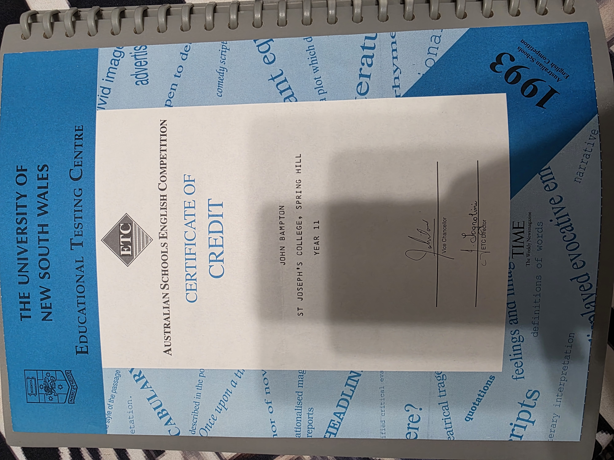
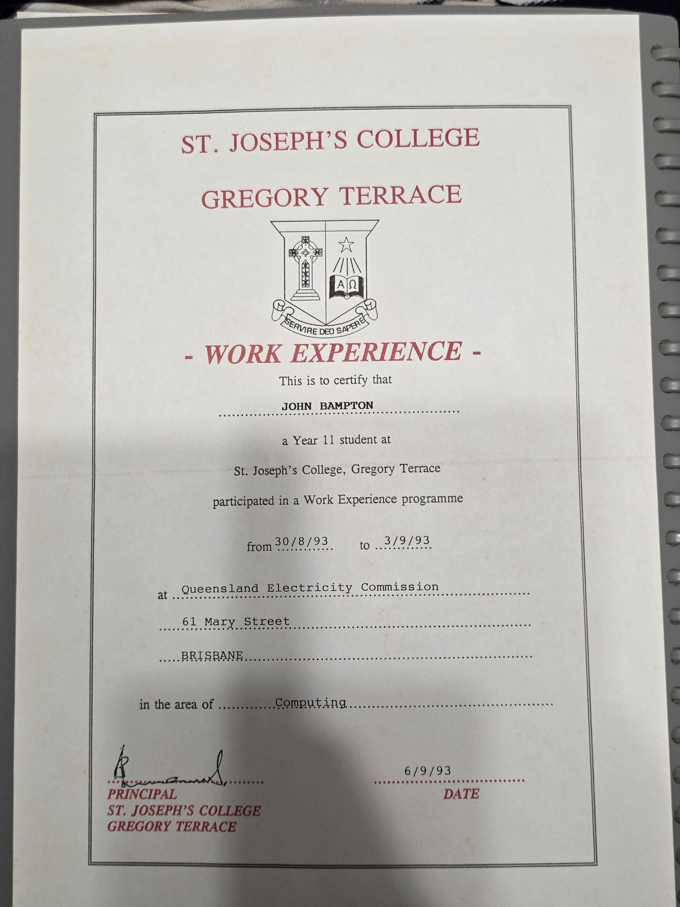
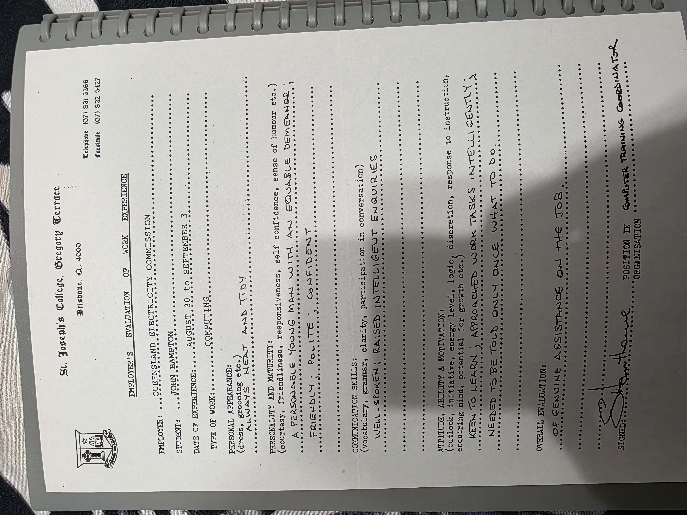
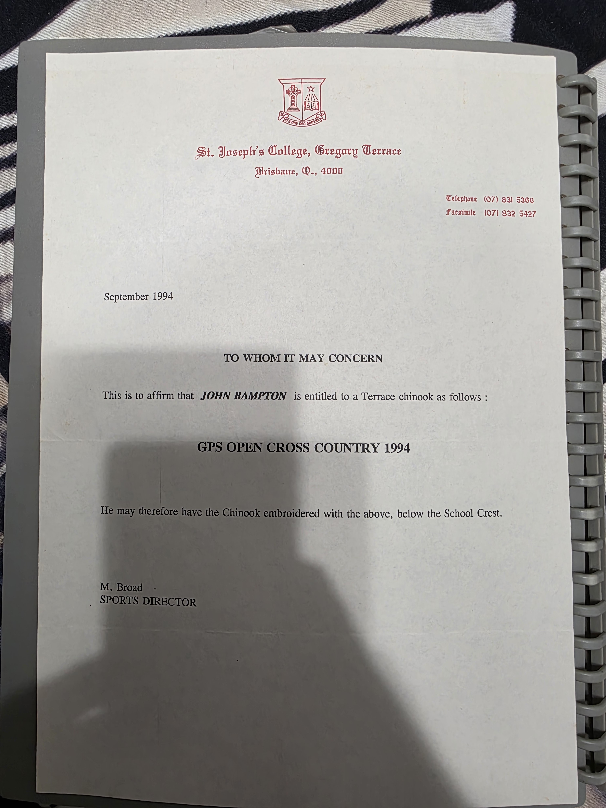
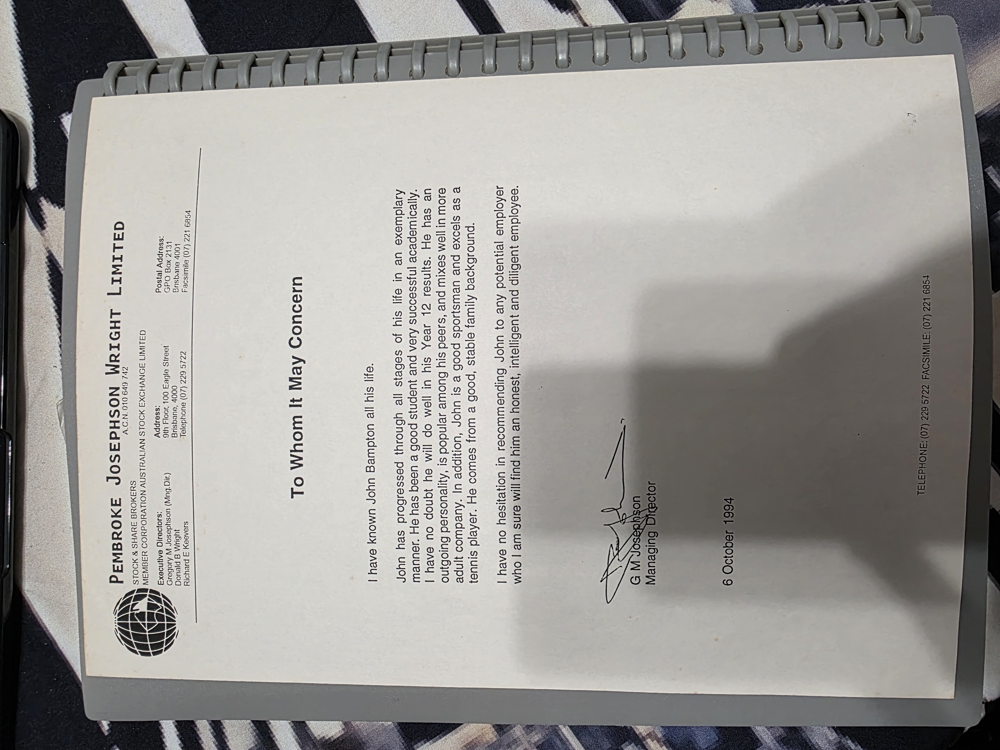
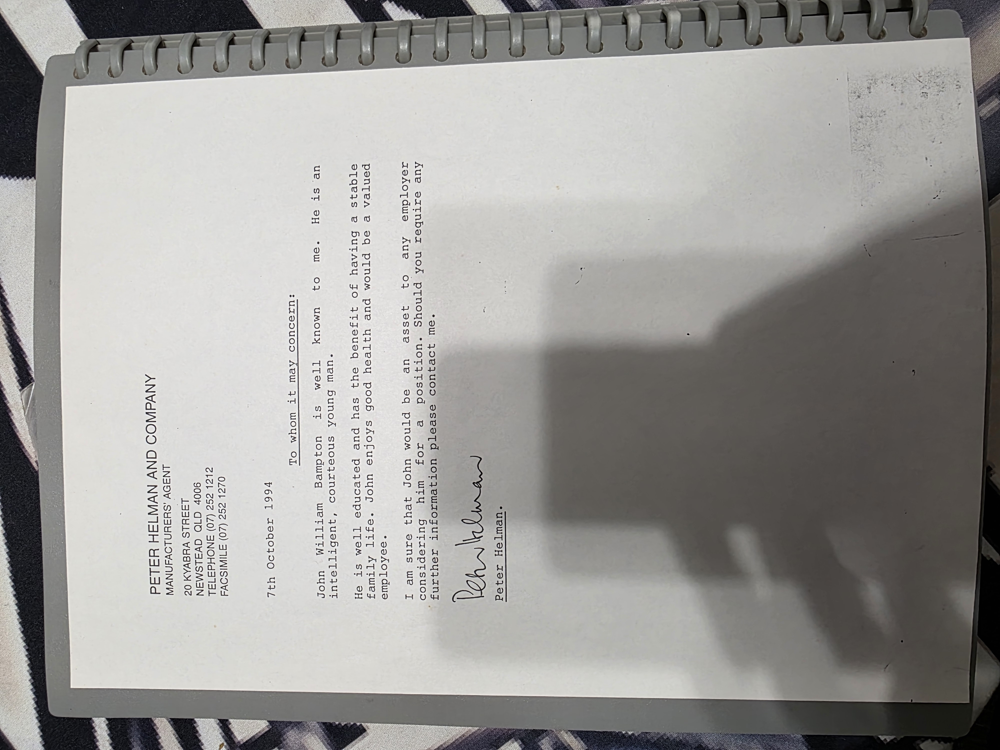
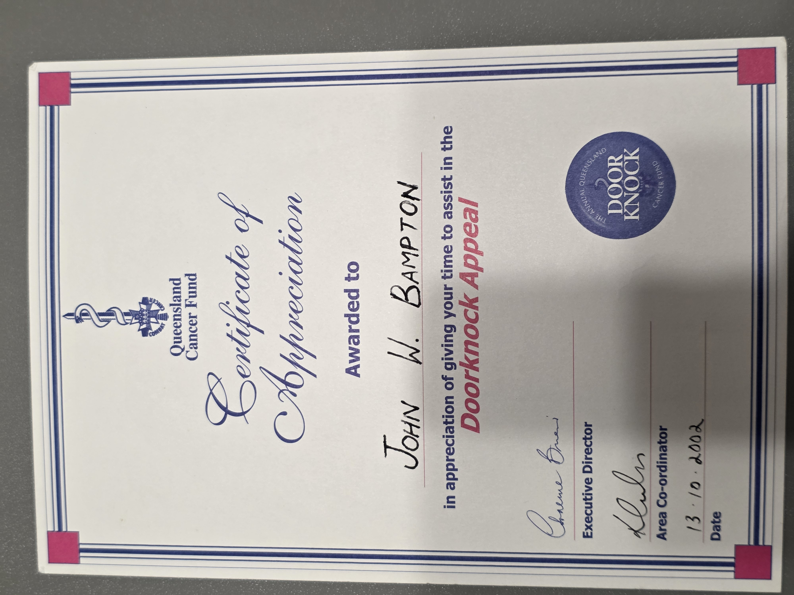
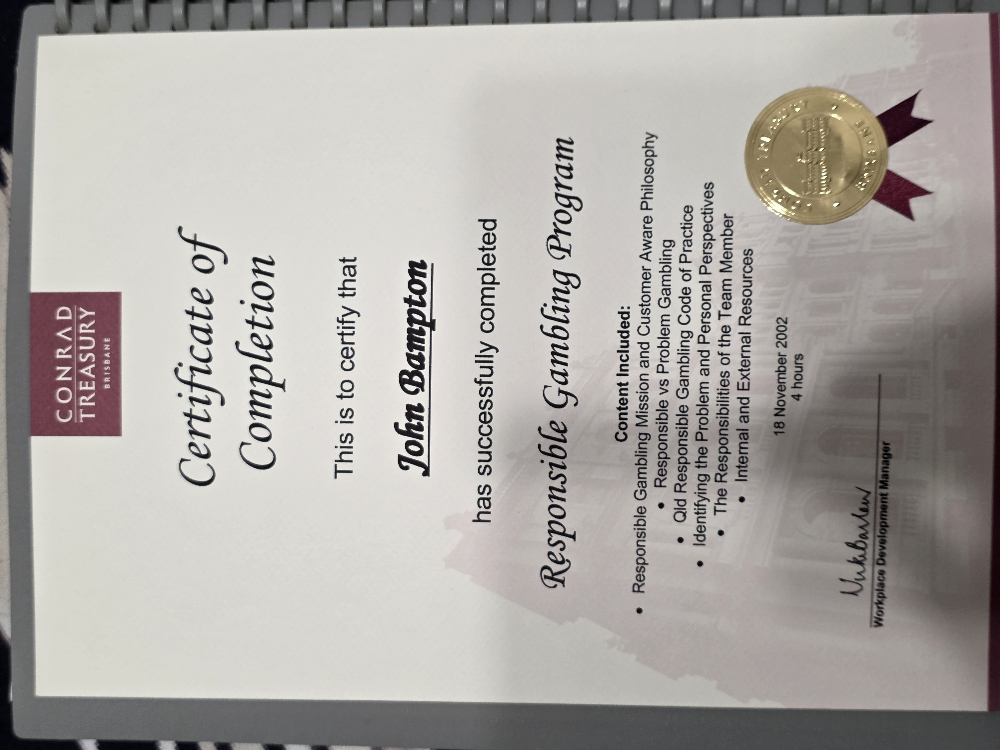
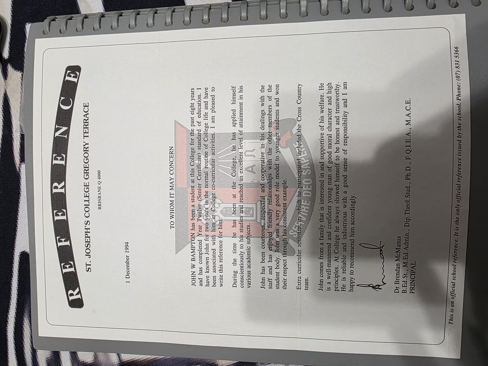
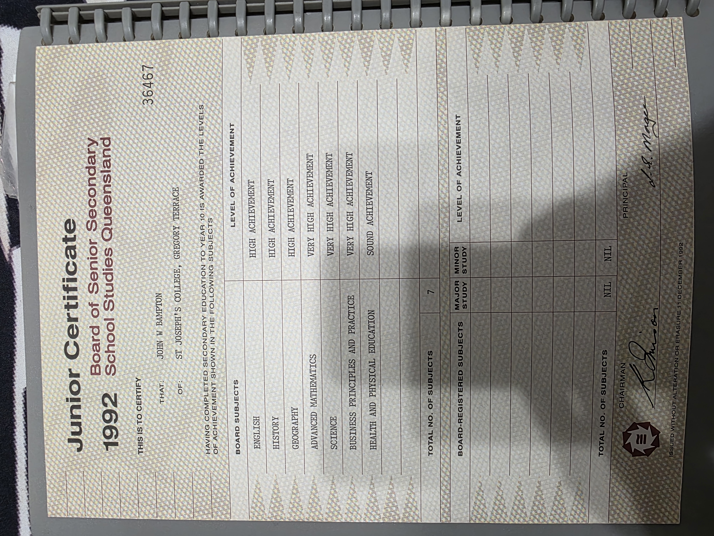

# Blast From The Past !!

## The [University of Queensland](https://www.uq.edu.au) ranks among the world's top 50 universities, delivering knowledge leadership and connecting with partners and communities for a better world.

---
 
## In late 1994 and 1995 I trained at the Malcolm Sue Kung Fu Academy in inner Brisbane where I studied Ging Mo Kune.

### Today, Malcolm's son [Si Fu Gawain Siu](https://gingmo.com.au/si-fu-gawain-siu) 8th Degree Red Belt continues the tradition at the Ging Mo Academy.

### Ging Mo Kune translates from Cantonese as "The Essence of Martial Arts" (Ging Mo meaning essence of martial arts, and Kune meaning fist or martial art style). It is a traditional style of Chinese martial arts rooted in Southern Praying Mantis (Chow Gar Tong Long) and internal energy practices

---

